[A partir du site officiel de Pulsar](https://pulsar.apache.org/docs/3.1.x/getting-started-helm/)
## Pré-requis

Ce tutoriel nécessite l'installation préalable de plusieurs logiciels :
1. **Docker**
2. **Kubernetes**
3. **Helm** (installateur Kubernetes)
4. **Minikube**
## Préparation du cluster Kubernetes

1. Récupération de la version de Kubernetes \<k8s-version> :
```bash 
kubectl version
```
`Client Version: v1.29.0`

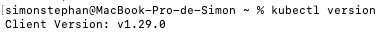

2. Création d'un cluster sur Kubernetes
```bash
minikube start --memory=8192 --cpus=4 --kubernetes-version=<k8s-version>
```

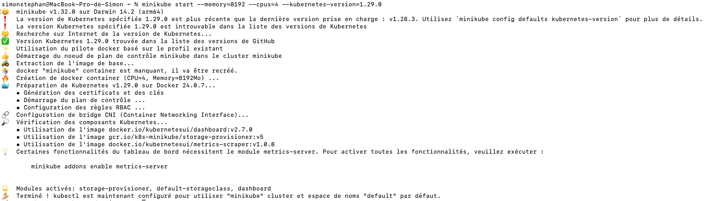

3. Informer Kubernetes de l'utilisation de Minikube
```bash
kubectl config use-context minikube
```

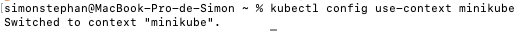

## Installation de Pulsar Helm

1. Téléchargement de la librairie `pulsar-helm-chart`
```bash
helm repo add apache https://pulsar.apache.org/charts
helm repo update
git clone https://github.com/apache/pulsar-helm-chart
cd pulsar-helm-chart

./scripts/pulsar/prepare_helm_release.sh -n pulsar -k pulsar-mini -c
```

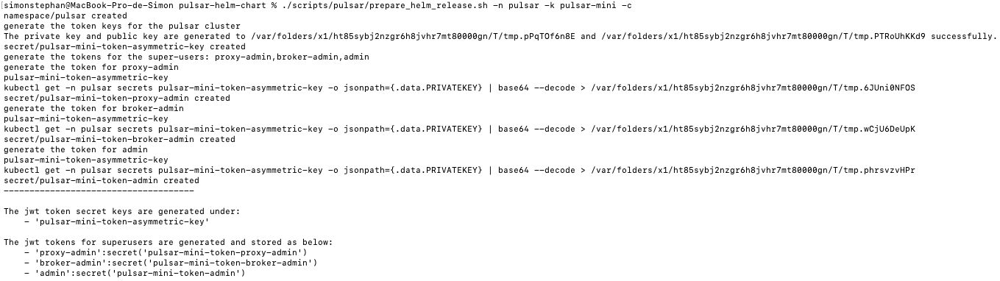
Le script `prepare_helm_release.sh` permet de créer les `secrets tokens` nécessaires à Pulsar.
*When running the script, you can use `-n` to specify the Kubernetes namespace where the Pulsar Helm chart is installed, `-k` to define the Pulsar Helm release name, and `-c` to create the Kubernetes namespace. For more information about the script, run `./scripts/pulsar/prepare_helm_release.sh --help`.*
[Source](https://pulsar.apache.org/docs/3.1.x/getting-started-helm/)

2. Création d'un cluster Pulsar sur Kubernetes
```bash
helm install --values examples/values-minikube.yaml --namespace pulsar pulsar-mini apache/pulsar
```

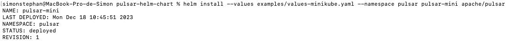

3. Vérification de l'état des `pods` (attention, il faut attendre que les `pods` aient status `RUNNING` ou `COMPLETED`). Il aura fallut 2 min pour que tous les `pods` soient prêt à l'utilisation, mais cela peut être plus long en fonction de la configuration de l'ordinateur.
```bash
kubectl get pods -n pulsar
```

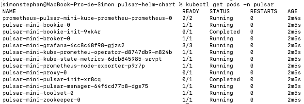
*En cas de problème, la commande `helm delete pulsar-mini --namespace pulsar` permet de tuer les `pods` afin de recommencer.*
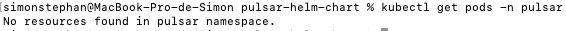

4. Vérification de l'état des services
```bash
kubectl get services -n pulsar
```

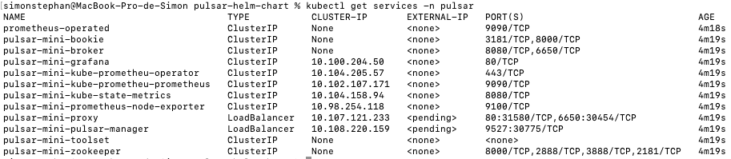

## Pulsar-admin : Initialisation du système et création d'un topic

1. Entrer dans le container `toolset`
   **Attention : La commande suivante ne fonctionnera que si `pulsar-mini-toolset-0`est bien passé en status `RUNNING`.**
```bash
kubectl exec -it -n pulsar pulsar-mini-toolset-0 -- /bin/bash
```


2. À l'intérieur du container, création d'un `TENANT`
   *Pulsar was created from the ground up as a multi-tenant system. To support multi-tenancy, Pulsar has a concept of tenants. Tenants can be spread across clusters and can each have their own [authentication and authorization](https://pulsar.apache.org/docs/3.1.x/security-overview/) scheme applied to them. They are also the administrative unit at which storage quotas, [message TTL](https://pulsar.apache.org/docs/3.1.x/cookbooks-retention-expiry/#time-to-live-ttl), and isolation policies can be managed.*
   [Source](https://pulsar.apache.org/docs/3.1.x/concepts-multi-tenancy/)

```bash
bin/pulsar-admin tenants create apache
```
3. Vérifier la création du `tenant`
```bash
bin/pulsar-admin tenants list
```

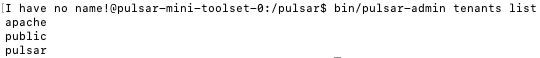
4. Création du namespace, à l'intérieur de `apache`
```bash
bin/pulsar-admin namespaces create apache/pulsar
bin/pulsar-admin namespaces list apache
```

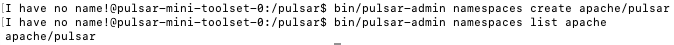
5. Création d'un `topic`
```bash
bin/pulsar-admin topics create-partitioned-topic apache/pulsar/test-topic -p 4
```

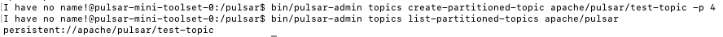

## Test du topic : Génération & Réception de messages

### Récupération des informations

1. Afficher les ports utilisés par notre instance Pulsar
```bash
kubectl get services -n pulsar | grep pulsar-mini-proxy
```

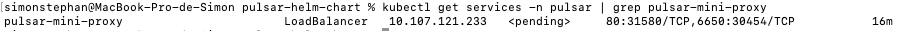
Dans notre exemple, la partie `80:31580/TCP,6650:30454/TCP` indique que:
- Le **port 31580** est renvoyé vers le **port 80** (accès HTTP)
- Le **port 30454** est renvoyé vers le **port 6650** (accès Binaire)

2. Ensuite, nous affichons l'adresse IP et les ports utilisés par notre instance `minikube`
```bash
minikube service pulsar-mini-proxy -n pulsar
```

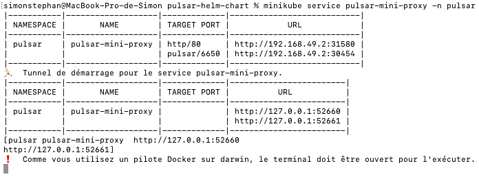
Nous avons ici l'URL à utiliser pour connecter nos clients à notre serveur Pulsar.
```yaml
webServiceUrl=http://127.0.0.1:52660/
brokerServiceUrl=pulsar://127.0.0.1:52661/
```

*Laissez ce terminal et ouvrez en un nouveau pour la suite*
### Envoi de messages
Afin de tester l'**envoi** et la **réception** de message, nous allons utiliser un outil prêt à l'emploi que nous allons télécharger sur le site de Pulsar : https://pulsar.apache.org/download/

1. Téléchargez la dernière version du binaire (dans ce tutoriel, nous utilisons la [version 3.1.1](https://www.apache.org/dyn/mirrors/mirrors.cgi?action=download&filename=pulsar/pulsar-3.1.1/apache-pulsar-3.1.1-bin.tar.gz))
2. Décompressez le fichier :
```bash
tar -xf <file-name>.tar.gz
```
3. Entrez dans le dossier
```bash
cd <file-name>
```
4. Enregistrez le dossier actuel comme étant le dossier Pulsar
```bash
export PULSAR_HOME=$(pwd)
```
5. Configurez le client de test. Pour cela, modifiez le fichier `${PULSAR_HOME}/conf/client.conf` en remplaçant les adresses `webServiceUrl` et `brokerServiceUrl` afin qu'elles correspondent aux adresses précédemment récupérées.


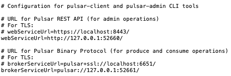

6. Créez un `consumer` de messages. Le consommateur de message se lance et se met en attente de messages. Il est abonné à un topic `test-topic` que nous avons créé précédemment.
```bash
bin/pulsar-client consume -s sub apache/pulsar/test-topic  -n 0
```

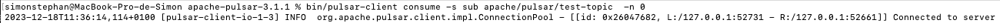
*Au lancement, vous devriez obtenir une ligne : `[sub] Success subscribe new topic persistent://apache/pulsar/test-topic in topics consumer, partitions: 4, allTopicPartitionsNumber: 4`*

*Laissez ce terminal et ouvrez en un nouveau pour la suite*

7. Créez un `producer` de messages. Le producteur de message va créer plusieurs messages et les envoyer au topic `test-topic`.
```bash
bin/pulsar-client produce apache/pulsar/test-topic  -m "---------hello apache pulsar-------" -n 10
```

8. Vérifiez la transmission :
   Dans le terminal du `producer` : `10 messages successfully produced`
   

   Dans le terminal du `consummer`: Réception des messages transmis
   
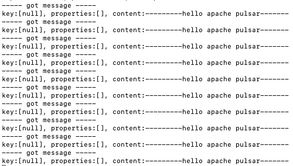


## Exemple : Ping-Pong Pulsar Project

### Introduction
Le projet présenté ici permet de tester la communication entre deux objets Java via Pulsar.

### Le code du projet
- `Communication.java` : Cette classe a été créée pour regrouper les méthodes utilisées dans ce projet. Elle est importante pour celui-ci, mais facultative si vous passez directement par les méthodes de la librairie `pulsar-client`.
- `PulsarConsumer.java` : Cette classe permet de créer un consommateur de message. Elle définit le comportement du consommateur lors de la réception d'un message.
- `PulsarProducer.java` : Cette classe permet de créer un producteur de message. Elle définit le comportement du producteur lors de la réception d'un message.
- `messages/` : Ce package contient les classes de messages utilisées dans ce projet (`Create`, `Die`, `Ping`, `Pong`).

### Lancement du projet

1. Téléchargez le projet sur GitHub
```bash
git clone https://github.com/TheCodingHornet/PulsarPingPong
```

2. Importez le projet dans votre IDE préféré (ici, IntelliJ)
3. Configurez le canal de communication de test. Pour cela, modifiez le fichier `lib/Communication.java` en remplaçant l'adresse `SERVICE_URL`.
4. Lancez le projet

### Déroulement du programme
1. Le programme va créer 3 `objects` :
   - 1 `object` producteur
   - 2 `objects` consommateurs

2. Chaque objet va créer un thread par topic (`lifecycle`, `ping` et `pong`)
3. À la réception du message `Create` sur le thread `lifecycle`, le producteur :
    - Ajoute l'id de l'agent dans sa liste
    - Envoi un premier message `Ping` à tous les agents en vie
    - Ecoute les messages `Pong` des agents en vie
4. À la réception d'un message `Pong` sur le thread `pong`, le consommateur :
   - Vérifier qu'il y a au moins 1 agent en vie
   - Envoi un message `Ping` aux agents en vie
5. À la réception d'un message `Ping` sur le thread `ping`, le consommateur :
   - Envoi un message `Pong` au producteur
6. Lorsqu'un agent meurt, il envoi un message `Die` au producteur
7. À la réception d'un message `Die` sur le thread `lifecycle`, le producteur :
    - Retire l'id de l'agent de sa liste

### Exemple de résultat

```cmd
Nouvel agent créé avec ID: a5eb2039-720c-4b21-916d-0973e0e53bd7
PingMessage envoyé à 1 agents.
PingMessage reçu par l'agent : a5eb2039-720c-4b21-916d-0973e0e53bd7
PongMessage envoyé.
PongMessage reçu: f14979b9-1cd8-4eba-9113-fa501a55ba92

PingMessage envoyé à 1 agents.
PingMessage reçu par l'agent : a5eb2039-720c-4b21-916d-0973e0e53bd7
PongMessage envoyé.
PingMessage reçu par l'agent : d6abb94f-5491-47bc-b721-aa0dc5ec4163

Nouvel agent créé avec ID: d6abb94f-5491-47bc-b721-aa0dc5ec4163
PongMessage envoyé.
PingMessage envoyé à 2 agents.
PingMessage reçu par l'agent : d6abb94f-5491-47bc-b721-aa0dc5ec4163
PingMessage reçu par l'agent : a5eb2039-720c-4b21-916d-0973e0e53bd7
PongMessage envoyé.
PongMessage envoyé.
PongMessage reçu: 7df2ab76-c0f6-43a5-807a-ae0fe1a867bc

PingMessage envoyé à 2 agents.
PingMessage reçu par l'agent : a5eb2039-720c-4b21-916d-0973e0e53bd7
PingMessage reçu par l'agent : d6abb94f-5491-47bc-b721-aa0dc5ec4163
PongMessage envoyé.
PongMessage envoyé.
PongMessage reçu: c6c39047-2f62-48c8-add6-f8ab33e3e58f
PingMessage envoyé à 2 agents.
PingMessage reçu par l'agent : a5eb2039-720c-4b21-916d-0973e0e53bd7
PingMessage reçu par l'agent : d6abb94f-5491-47bc-b721-aa0dc5ec4163
PongMessage envoyé.
PongMessage envoyé.
DieMessage envoyé par l'agent: d6abb94f-5491-47bc-b721-aa0dc5ec4163
DieMessage envoyé par l'agent: a5eb2039-720c-4b21-916d-0973e0e53bd7
```


